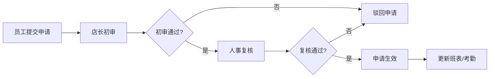

## 1. 产品概述

门店考勤管理系统是一款面向连锁零售企业的考勤管理平台，服务于门店店长和总部人事两大角色，实现排班、打卡、审批、统计全流程数字化管理。

- 核心价值：提升考勤管理效率，减少人工核对成本，规范门店考勤制度，实现总部对门店考勤的统一管控
- 目标用户：连锁门店店长、总部人事专员/经理、门店员工

## 2. 核心功能

### 2.1 用户角色

| 角色 | 登录方式 | 核心权限 |
|------|----------|----------|
| 门店店长 | 账号密码登录 | 排班管理、打卡审核、请假/调班初审、异常处理、本门店数据查看 |
| 总部人事 | 账号密码登录 | 全门店数据查看、考勤复核、黑名单管理、月末锁账、奖扣计算、证明下载 |
| 门店员工 | 移动端打卡 | 查看班表、移动打卡、提交请假/调班申请、查看考勤记录 |

### 2.2 功能模块

1. **门店看板**：门店考勤概览、今日出勤统计、异常预警、本周排班概览
2. **员工班表**：按店排班、班次复制、临时换班、跨店支援、班次管理
3. **移动打卡记录**：打卡照片核验、距离异常提示、缺勤登记、打卡记录查询
4. **异常工单**：异常类型管理、工单流转、异常处理、申诉处理
5. **请假调班**：请假申请、调班申请、请假额度查看、申请记录
6. **审批中心**：待审批列表、店长初审、人事复核、审批历史
7. **总部汇总**：门店排行、考勤奖扣计算、月末锁账、员工出勤证明下载、黑名单规则

### 2.3 页面详情

| 页面名称 | 模块名称 | 功能描述 |
|----------|----------|----------|
| 门店看板 | 数据概览卡片 | 展示今日应到人数、实到人数、缺勤人数、迟到人数等关键指标 |
| 门店看板 | 异常预警列表 | 展示当日打卡异常、距离异常、缺勤等预警信息，支持快速处理 |
| 门店看板 | 本周排班概览 | 以周视图展示本周各门店/员工排班情况 |
| 门店看板 | 门店选择器 | 支持切换不同门店查看数据（总部人事视角） |
| 员工班表 | 班表日历 | 月视图/周视图展示员工排班，支持拖拽调整班次 |
| 员工班表 | 班次管理 | 预设班次模板（早班、中班、晚班、休息等），支持自定义班次 |
| 员工班表 | 排班操作 | 按店排班、批量排班、班次复制（复制上周/上月） |
| 员工班表 | 跨店支援 | 支援申请、支援人员管理、跨店排班 |
| 员工班表 | 临时换班 | 员工间换班申请、店长审批、换班记录 |
| 移动打卡记录 | 打卡记录列表 | 展示打卡时间、地点、照片、状态，支持筛选和搜索 |
| 移动打卡记录 | 照片核验 | 查看打卡照片、人脸比对结果、照片真实性校验 |
| 移动打卡记录 | 距离异常 | 标记距离门店过远的打卡记录，异常高亮提示 |
| 移动打卡记录 | 缺勤登记 | 手动登记缺勤、补卡申请、缺勤原因记录 |
| 异常工单 | 异常工单列表 | 展示所有异常工单，按状态/类型筛选 |
| 异常工单 | 工单详情 | 异常详情、处理记录、申诉内容、处理操作 |
| 异常工单 | 异常类型 | 迟到、早退、缺勤、打卡异常、距离异常等类型管理 |
| 请假调班 | 请假申请 | 选择请假类型、日期、原因，提交申请 |
| 请假调班 | 调班申请 | 选择调换对象、日期、班次，提交申请 |
| 请假调班 | 额度查看 | 展示年假、病假、调休等剩余额度和使用记录 |
| 请假调班 | 申请记录 | 历史申请记录、审批状态、审批意见 |
| 审批中心 | 待办审批 | 店长/人事待审批的请假、调班、异常工单列表 |
| 审批中心 | 审批操作 | 同意/拒绝、填写审批意见、批量审批 |
| 审批中心 | 审批历史 | 已审批记录查询、审批流转记录 |
| 总部汇总 | 门店排行 | 按出勤率、异常率等指标进行门店排名 |
| 总部汇总 | 奖扣计算 | 考勤奖金/罚款自动计算，支持人工调整 |
| 总部汇总 | 月末锁账 | 月度考勤数据锁定，锁定后不可修改 |
| 总部汇总 | 出勤证明 | 员工出勤证明生成与下载（PDF） |
| 总部汇总 | 黑名单规则 | 黑名单规则配置、黑名单人员管理、自动触发机制 |

## 3. 核心流程

### 3.1 排班流程

店长在员工班表页面选择门店和日期，从班次模板中选择班次分配给员工，支持批量排班和班次复制。排班完成后员工可在移动端查看班表。

### 3.2 打卡与异常处理流程

员工通过移动端打卡，系统自动校验距离和照片，异常情况生成工单，店长初审后人事复核。

### 3.3 请假调班审批流程

员工提交请假或调班申请，店长初审通过后进入人事复核，最终审批结果通知员工。

## 4. 用户界面设计

### 4.1 设计风格

- **主色调**：深蓝色 (#1e3a5f) 作为主色，代表专业和可靠；搭配青色 (#0ea5e9) 作为辅助色，体现科技感
- **强调色**：橙色 (#f97316) 用于异常预警和重要操作按钮
- **成功色**：绿色 (#10b981) 表示正常、通过
- **警告色**：红色 (#ef4444) 表示异常、拒绝
- **设计风格**：现代企业级应用风格，卡片式布局，简洁清爽，数据可视化突出
- **按钮样式**：圆角矩形按钮，主按钮有渐变效果，悬停有微动画
- **字体**：使用 Noto Sans SC 作为主字体，标题加粗，正文清晰易读
- **图标风格**：线性图标，简洁现代

### 4.2 页面设计概览

| 页面名称 | 模块名称 | UI 元素 |
|----------|----------|---------|
| 门店看板 | 数据概览卡片 | 渐变背景卡片、数据数字大号字体、趋势指标小标签、图标装饰 |
| 门店看板 | 异常预警列表 | 列表卡片、异常类型标签、状态徽章、快速处理按钮 |
| 门店看板 | 排班概览 | 周视图日历、班次色块、员工头像、悬停详情 |
| 员工班表 | 班表日历 | 月/周切换、日历网格、班次色块、拖拽交互 |
| 员工班表 | 操作工具栏 | 门店选择、日期切换、班次模板、操作按钮组 |
| 移动打卡记录 | 记录列表 | 表格布局、照片缩略图、距离标签、状态徽章 |
| 移动打卡记录 | 照片核验弹窗 | 大图展示、位置信息、核验结果、操作按钮 |
| 异常工单 | 工单列表 | 卡片式列表、优先级标签、状态流转进度条、处理按钮 |
| 请假调班 | 申请表单 | 分步表单、日期选择器、类型选择、额度提示 |
| 审批中心 | 待办列表 | 标签页切换、审批卡片、快速操作按钮、审批意见输入 |
| 总部汇总 | 数据看板 | 图表可视化（柱状图、折线图、饼图）、排行榜、统计卡片 |

### 4.3 响应式设计

- 采用桌面端优先设计，同时适配平板和移动端
- 侧边导航在移动端转为底部 Tab 导航
- 数据表格在移动端支持横向滚动和卡片式展示
- 触控操作优化，确保按钮和可点击区域足够大

### 4.4 动效设计

- 页面切换使用淡入淡出过渡
- 数据卡片加载时使用渐入和轻微上浮动画
- 按钮悬停有颜色渐变和轻微放大效果
- 异常提醒有呼吸灯动画效果
- 排班拖拽有阴影和缩放反馈
