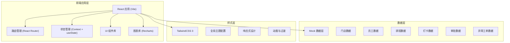
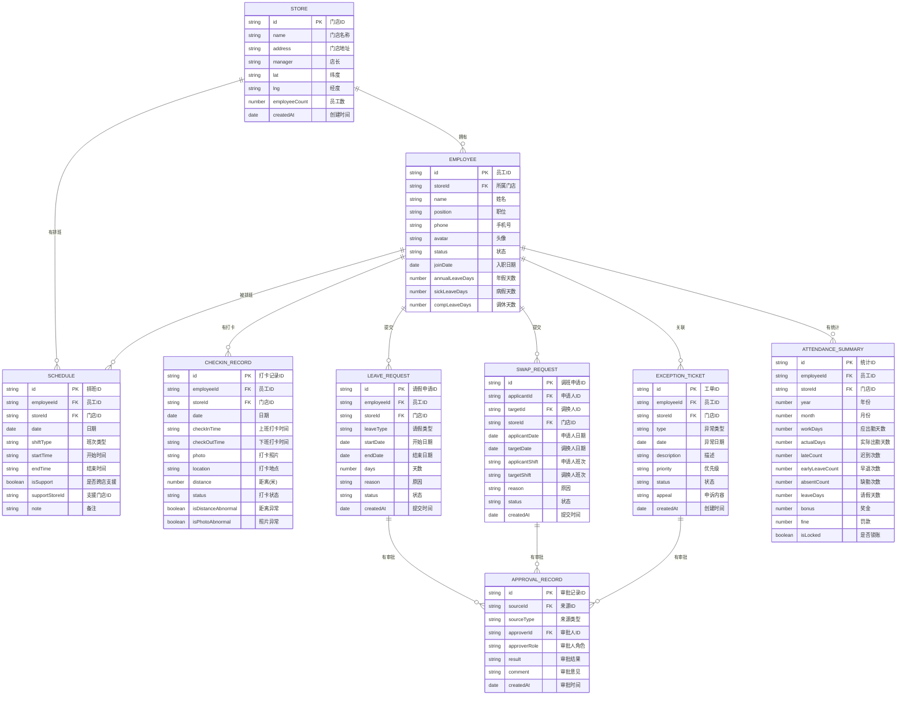

## 1. 架构设计

本系统采用纯前端架构，使用 React 构建单页应用（SPA），所有业务数据采用 Mock 数据模拟，便于前端开发和演示。



## 2. 技术描述

- **前端框架**：React 18 + TypeScript
- **构建工具**：Vite 5
- **样式方案**：TailwindCSS 3
- **路由管理**：React Router v6
- **图表库**：Recharts
- **图标库**：Lucide React
- **状态管理**：React Context + Hooks
- **日期处理**：date-fns
- **Mock 数据**：本地 JSON 数据 + 工具函数生成

## 3. 路由定义

| 路由路径 | 页面名称 | 说明 |
|----------|----------|------|
| `/dashboard` | 门店看板 | 系统首页，展示考勤概览数据 |
| `/schedule` | 员工班表 | 排班管理页面 |
| `/checkin` | 移动打卡记录 | 打卡记录与核验页面 |
| `/exceptions` | 异常工单 | 异常工单管理页面 |
| `/leave` | 请假调班 | 请假与调班申请页面 |
| `/approval` | 审批中心 | 审批待办与历史页面 |
| `/summary` | 总部汇总 | 数据汇总与统计页面 |

## 4. 数据模型

### 4.1 数据模型定义



### 4.2 核心数据结构

```typescript
// 门店
interface Store {
  id: string;
  name: string;
  address: string;
  manager: string;
  lat: number;
  lng: number;
  employeeCount: number;
  createdAt: string;
}

// 员工
interface Employee {
  id: string;
  storeId: string;
  name: string;
  position: string;
  phone: string;
  avatar: string;
  status: 'active' | 'inactive' | 'blacklist';
  joinDate: string;
  annualLeaveDays: number;
  sickLeaveDays: number;
  compLeaveDays: number;
}

// 班次类型
type ShiftType = 'morning' | 'middle' | 'evening' | 'rest' | 'custom';

// 排班
interface Schedule {
  id: string;
  employeeId: string;
  storeId: string;
  date: string;
  shiftType: ShiftType;
  startTime: string;
  endTime: string;
  isSupport: boolean;
  supportStoreId?: string;
  note?: string;
}

// 打卡状态
type CheckinStatus = 'normal' | 'late' | 'early_leave' | 'absent' | 'pending';

// 打卡记录
interface CheckinRecord {
  id: string;
  employeeId: string;
  storeId: string;
  date: string;
  checkInTime?: string;
  checkOutTime?: string;
  photo: string;
  location: string;
  distance: number;
  status: CheckinStatus;
  isDistanceAbnormal: boolean;
  isPhotoAbnormal: boolean;
}

// 异常类型
type ExceptionType = 'late' | 'early_leave' | 'absent' | 'distance' | 'photo' | 'other';

// 异常工单
interface ExceptionTicket {
  id: string;
  employeeId: string;
  storeId: string;
  type: ExceptionType;
  date: string;
  description: string;
  priority: 'high' | 'medium' | 'low';
  status: 'pending' | 'processing' | 'resolved' | 'rejected';
  appeal?: string;
  createdAt: string;
}

// 请假类型
type LeaveType = 'annual' | 'sick' | 'personal' | 'compensation' | 'maternity' | 'other';

// 请假申请
interface LeaveRequest {
  id: string;
  employeeId: string;
  storeId: string;
  leaveType: LeaveType;
  startDate: string;
  endDate: string;
  days: number;
  reason: string;
  status: 'pending' | 'approved' | 'rejected';
  createdAt: string;
}

// 调班申请
interface SwapRequest {
  id: string;
  applicantId: string;
  targetId: string;
  storeId: string;
  applicantDate: string;
  targetDate: string;
  applicantShift: ShiftType;
  targetShift: ShiftType;
  reason: string;
  status: 'pending' | 'approved' | 'rejected';
  createdAt: string;
}

// 审批记录
interface ApprovalRecord {
  id: string;
  sourceId: string;
  sourceType: 'leave' | 'swap' | 'exception';
  approverId: string;
  approverRole: 'store_manager' | 'hr';
  result: 'approved' | 'rejected';
  comment: string;
  createdAt: string;
}

// 考勤汇总
interface AttendanceSummary {
  id: string;
  employeeId: string;
  storeId: string;
  year: number;
  month: number;
  workDays: number;
  actualDays: number;
  lateCount: number;
  earlyLeaveCount: number;
  absentCount: number;
  leaveDays: number;
  bonus: number;
  fine: number;
  isLocked: boolean;
}
```

## 5. 项目结构

```
src/
├── assets/           # 静态资源
├── components/       # 公共组件
│   ├── Layout/       # 布局组件
│   ├── Card/         # 卡片组件
│   ├── Table/        # 表格组件
│   ├── Modal/        # 弹窗组件
│   └── ...
├── pages/            # 页面组件
│   ├── Dashboard/    # 门店看板
│   ├── Schedule/     # 员工班表
│   ├── Checkin/      # 移动打卡记录
│   ├── Exceptions/   # 异常工单
│   ├── Leave/        # 请假调班
│   ├── Approval/     # 审批中心
│   └── Summary/      # 总部汇总
├── data/             # Mock 数据
│   ├── stores.ts
│   ├── employees.ts
│   ├── schedules.ts
│   ├── checkins.ts
│   └── ...
├── hooks/            # 自定义 Hooks
├── utils/            # 工具函数
├── types/            # TypeScript 类型定义
├── context/          # Context 状态
├── App.tsx
├── main.tsx
└── index.css
```

## 6. 核心功能实现方案

### 6.1 排班功能
- 使用日历网格展示排班，支持月视图和周视图切换
- 班次以不同颜色色块展示，支持拖拽调整
- 提供班次模板侧边栏，可快速分配班次
- 实现班次复制功能，支持复制上周/上月排班

### 6.2 打卡核验
- 打卡记录表格展示，支持按日期、门店、状态筛选
- 照片核验弹窗，展示打卡大图、位置信息、距离数据
- 距离异常自动标记，红色高亮展示
- 支持缺勤登记和补卡申请

### 6.3 审批流程
- 审批中心分为待审批、已审批标签页
- 支持请假、调班、异常工单三类审批
- 实现店长初审 → 人事复核二级审批
- 支持批量审批操作

### 6.4 数据统计
- 使用 Recharts 实现柱状图、折线图、饼图
- 门店排行榜按出勤率排名
- 考勤奖扣自动计算，支持手动调整
- 月末锁账功能，锁定后数据只读
